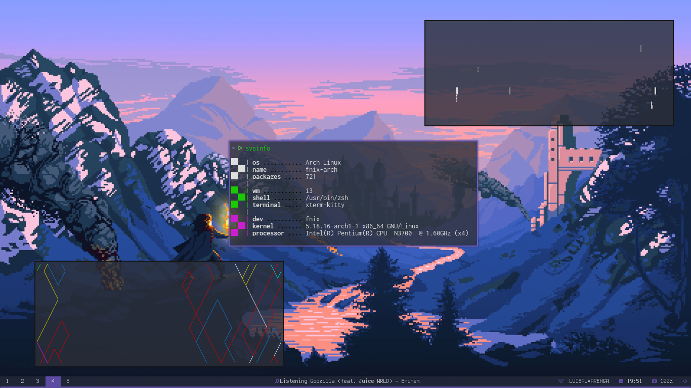

<p align="center">
    <a href="https://github.com/fnixdev/Dotfiles"></a>
    <br>
    <b>Just my dotfiles</b>
</p>

<p> <b>Install</b>

```bash
bash <(curl -s https://raw.githubusercontent.com/fnixdev/Dotfiles/master/install.sh)
```
</p>